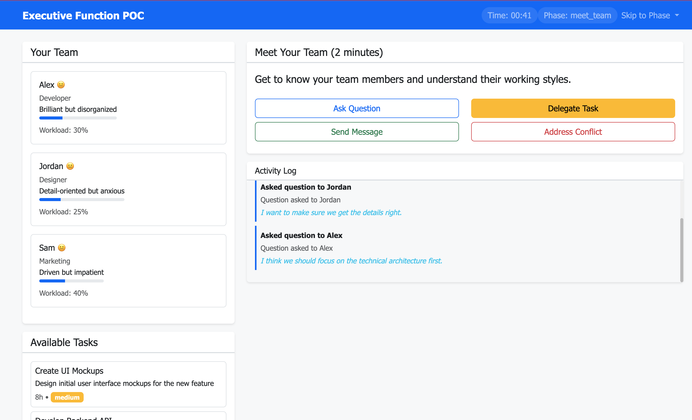
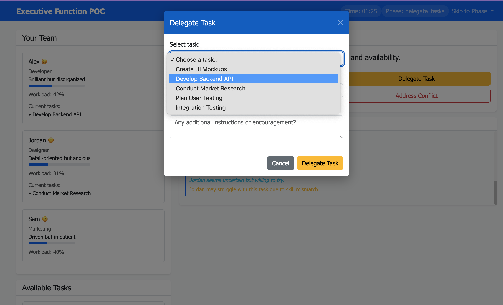
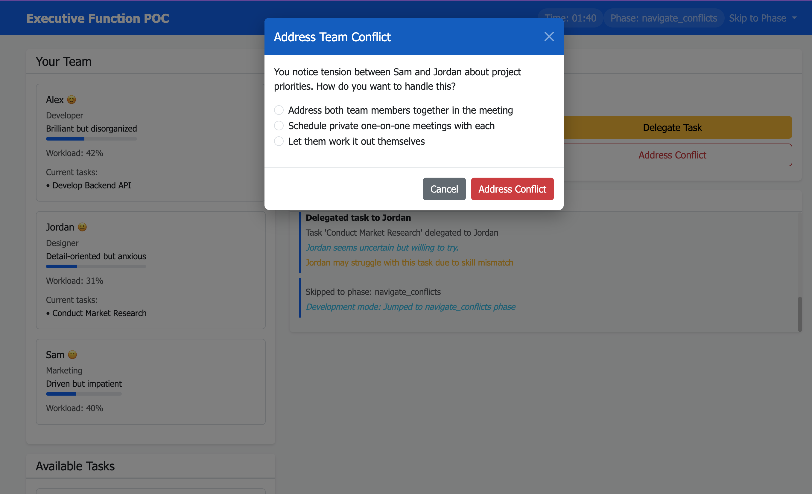
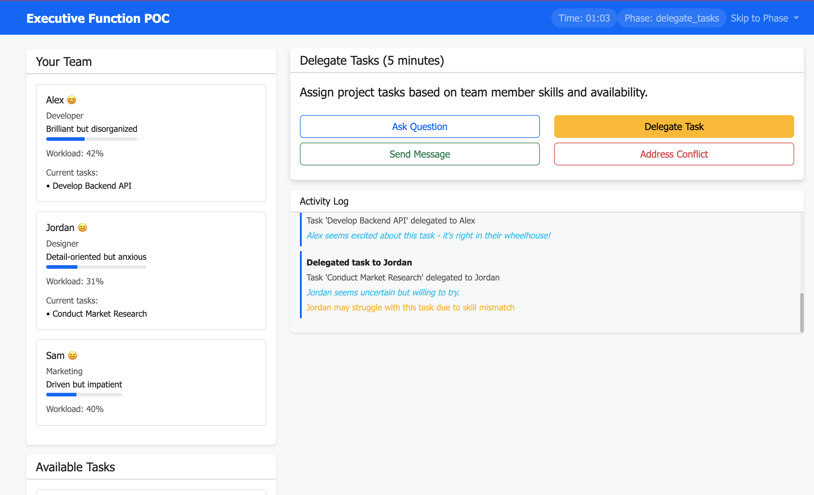
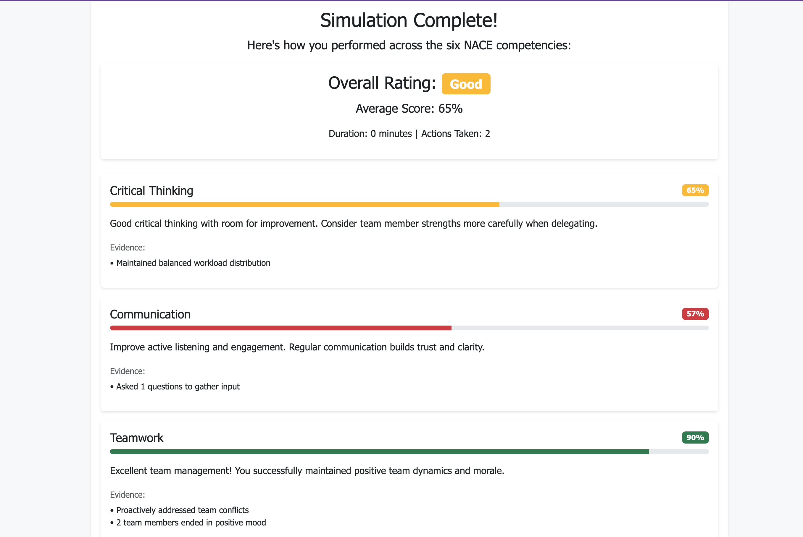

# Executive Function POC

## Overview
A 10-minute workplace simulation where users lead their first team meeting, testing executive function through realistic team dynamics and decision-making.

 

## Tech Stack
- **Backend**: FastAPI + SQLite
- **Frontend**: Bootstrap 5 + Vanilla JS
- **Deployment**: Single Docker container

## Core Simulation Loop

### 1. Meet Your Team (2 min)
Quick introductions revealing each member's working style. For example:
- **Alex (Developer)**: Brilliant but disorganized
- **Jordan (Designer)**: Detail-oriented but anxious  
- **Sam (Marketing)**: Driven but impatient

### 2. Delegate Tasks (5 min)
Assign project tasks based on:
- Team member skills
- Current workload
- Personality fit
- Task urgency

### 3. Navigate Conflicts (3 min)
Handle emerging tensions:
- Who to address first
- What approach to take
- When to intervene vs. let it play out

 

## Assessment Framework

Based on [NACE Career Readiness Competencies](https://www.naceweb.org/career-readiness/competencies/career-readiness-defined#competencies):

| Competency | How We Measure |
|------------|----------------|
| **Critical Thinking** | Task assignment logic, priority decisions |
| **Communication** | Message clarity, active listening indicators |
| **Teamwork** | Inclusion balance, conflict resolution |
| **Leadership** | Decision timing, team morale management |
| **Professionalism** | Response consistency, meeting time management |
| **Equity & Inclusion** | Ensuring all voices heard, adapting communication style |



## API Structure

```python
# Core endpoints
POST /api/session/start
GET  /api/session/{id}/state
POST /api/session/{id}/action
GET  /api/session/{id}/results

# Action types
{
    "type": "delegate_task",
    "task_id": "create_mockups",
    "assignee": "jordan",
    "message": "optional_encouragement"
}
```

## Key Features

### Dynamic Personalities
Each team member has:
- Mood states (😊 → 😐 → 😟)
- Trigger points (e.g., Sam gets frustrated with long discussions)
- Growth conditions (e.g., Jordan gains confidence with positive feedback)

### Realistic Constraints
- Timer pressure (10-minute meeting)
- Limited attention budget (can't address everything)
- Cascading consequences (ignored issues compound)

## Quick Start

```bash
# Clone and install
git clone [repo]
cd fsu-demo

# Install dependencies (uv will automatically create virtual environment)
uv sync

# Run development server
uv run uvicorn backend.main:app --reload --host 0.0.0.0 --port 5001

# Navigate to http://localhost:5001
```

### Alternative Commands

```bash
# Run production server
uv run uvicorn backend.main:app --host 0.0.0.0 --port 5001

# Install additional dependencies
uv add <package-name>

# Run with different port
uv run uvicorn backend.main:app --reload --port 3000
```

## Project Structure
```
fsu-demo/
├── backend/
│   ├── __init__.py
│   ├── main.py          # FastAPI application entry point
│   ├── models.py        # Pydantic data models
│   ├── scoring.py       # NACE competency scoring logic
│   └── scenarios.py     # Team member personalities and scenarios
├── frontend/
│   ├── index.html       # Main simulation interface
│   ├── simulation.js    # Client-side simulation logic
│   └── styles.css       # Custom styling and responsive design
├── pyproject.toml       # uv project configuration and dependencies
├── uv.lock             # Lock file for reproducible builds
└── README.md
```

---

## References
The methodologies that I drew inspiration from:

### Project-Based Learning
The simulation follows [Kolb's learning cycle](https://www.simplypsychology.org/learning-kolb.html):
1. Concrete Experience: The meeting scenario
2. Reflective Observation: Post-simulation metrics showing impact of decisions
3. Abstract Conceptualization: Connecting actions to NACE competencies
4. Active Experimentation: Applying insights in real workplace

### Career Coaching
- [Situational Leadership II](https://www.kenblanchard.com/Solutions/Situational-Leadership-II) - Players adapt leadership styles based on team member's skill and motivation level. There should be no one-size-fits-all approach.  
- [Radical Candor](https://www.radicalcandor.com/our-approach/) - Players (hopefully) learn to care personally AND challenge directly. This mainly teaches to avoid ruinous empathy or obnoxious aggression. 

---

## Future Work

### Using actual LLMs
I've run out of free credits from OpenAI and Anthropic, but these improvements would be the first thing on my mind:
- Each character gets their own system prompt with personality traits
- Let them actually converse naturally instead of scripted responses
- Adaptive difficulty using RL to adjust complexity based on performance
- Real-time AI coaching during simulations -> again pulling in these career coaching frameworks as needed
- More realistic relationship dynamics that build up over time
- Multimodality -> as mentioned in the doc, using Pika to create images, or something for voice synthesis
- MANY more Agentic AI features ahead too!
  - Multi-agent orchestration with specialized roles (facilitator, observer, subject matter expert agents)
  - Tool-using agents that can access external APIs, search knowledge bases, and generate dynamic scenarios
  - Self-improving agents that learn from user interactions and adapt their coaching strategies over time 

### Making it scale
- Postgres for user data, maybe Redis for real-time state
- Break into microservices - simulation engine, scoring, user management
- Multi-user scenarios could be interesting for team training
- Docker + AWS with auto-scaling

### More coaching frameworks
- [The Five Practices](https://www.leadershipchallenge.com/about-tlc-about.aspx) - We could create specific mini-challenges for each practice, like "inspire a demotivated Jordan" or "enable Sam to mentor Alex."
- [Tuckman's Team Stages](https://www.mindtools.com/pages/article/newLDR_86.htm) - With more thought, we could involve a multi-session arc where the same team progresses through stages, requiring different leadership approaches each time.
- [Multipliers](https://thewisemangroup.com/books/multipliers/) - Potentially add "team output multiplier" metric showing how user's leadership style affects collective team performance vs. individual contributions.